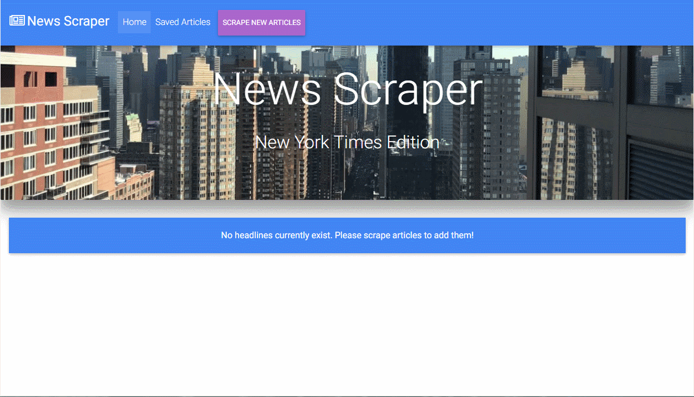

# News-Scraper
News Scraper with MongoDB, Mongoose ORM, Node, Express and Handlebars

This is a full stack news application which allows users to view and leave comments on the latest New York Times articles.

The user has the following options:
1) View previously scraped articles.
2) View saved articles.
3) Scrape the New York Times for new articles.

While viewing previously scraped articles, the user has the option to delete the article from the database or save the article.

While viewing saved articles, the user has the option to delete the article from the saved list (not from the database) or add a note.

Each time the user scrapes the New York Times for articles, the application informs the user of how many new articles were scraped.

Please refer to the video below for details regarding how the app works.

## Getting Started

You should be able to download the files via the github pages link below and run locally on your computer:
[https://github.com/emswann/News-Scraper](https://github.com/emswann/News-Scraper).

The application has also been published on Heroku:
[https://news-scraper-ems.herokuapp.com/](https://news-scraper-ems.herokuapp.com/).

## Prerequisites

NPM install based on package.json.

## Built With

* [MDBootstrap](https://mdbootstrap.com/) - Front-end HTML, CSS, javascript framework for creating responsive web applications. 
* [JavaScript](https://www.javascript.com/) - Programming language.
* [jQuery](https://jquery.com/) - Javascript library.
* [node.js](https://nodejs.org/en/) - Server side programming language.
* [express](https://www.npmjs.com/package/express) - Web application framework used for server side routing.
* [express-handlebars](https://www.npmjs.com/package/express-handlebars) - Middleware template engine used to render HTML templates.
* [body-parser](https://www.npmjs.com/package/body-parser) - Middleware parser used for incoming request bodies.
* [cheerio](https://www.npmjs.com/package/cheerio) - node.js package which parses markup and provides an API for traversing/manipulating the resulting data structure.
* [request](https://www.npmjs.com/package/request) - Simplified node.js HTTP request client..
* [mongoose](https://www.npmjs.com/package/sequelize) - Promised based ORM for using MongoDB in Node.js
* [dotenv](https://www.npmjs.com/package/dotenv) - Loads environment variables from .env file.

## Contributing

Please feel free to offer any suggestions. As always, programming is a work of art in progress.

## Author

* **Elaina Swann** - [Github](https://github.com/emswann)
